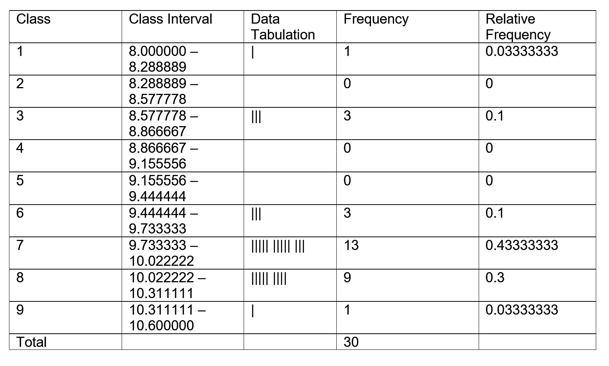

```{r setup, include=FALSE}
knitr::opts_chunk$set(echo = TRUE)
```

# Tasks Completed
I finished 15/15 tasks

# Task 1
According to the syllabus, the course will be graded as follows:  
1. 4 Assignments - 15%  
2. Labs - 10%    
3. 2 Projects - 10%
4. Clicker Quizzes - 10%  
5. Chapter online CANVAS quizzes - 5%  
6. Midterm Exams - 20%  
7. Final - 30%  

**Grading Scale (no curve):** A (90s) B(80s) C(60s and 70s) D(50s) F(<50)  
 
# Task 2
Load the DDT data frame
```{r}
ddt = read.csv("DDT.csv")
head(ddt)
```
(a)
Make some colors
```{r}
m = with(ddt, as.numeric(factor(MILE))) # A
length(unique(m)) #B
```
coplot:  
```{r}
coplot(LENGTH~WEIGHT|RIVER*SPECIES, data = ddt, col = m)
```

(b) Catfish was the only type of fish caught in the FCM, LCM, and SCM rivers.  
(c) Line A is taking the MILE data and assigning each point a bin based on value. This is used by the coplot to set the color of the points
(d) Line B removes all duplicate bin assignments and shows the number of unique bins (colors) there are  
(e) The top six plots are empty because Bass and Buffalo fish were not caught in the FCM, LCM, or the SCM  
(f) 
```{r}
cat_fcm = with(ddt, ddt[SPECIES == "CCATFISH" & RIVER == "FCM",])
head(cat_fcm)
mean(cat_fcm$DDT)
```

# Task 3
(a) Quantitative  
(b) Quantitative  
(c) Qualitative  
(d) Quantitative  
(e) Qualitative  
(f) Quantitative  
(g) Qualitative  

# Task 4
(a) Simple Random Sampling, Stratified Random Sampling, Cluster Sampling, Systematic Sampling  
(b)   
- Simple Random Sampling: To randomly choose N experimental units, select one randomly from the population, but do not put it back into the population. Keep selecting randomly until there are N experimental units in the sample.  
- Stratified Random Sampling: Split all of the experimental units into different groups based on their characteristics. Randomly sample these units by using simple random sampling within the groups. Then combine the samples of the groups together.   
- Cluster Sampling: If the population of experimental units is grouped in clusters, randomly sample the clusters rather than the experimental units.
- Systematic Sampling: Choose every Kth experimental unit for the sample

# Task 5
```{r}
mtbe = read.csv("MTBE.csv")
head(mtbe)
dim(mtbe)
ind = sample(1:223, 5, replace = FALSE)
mtbe[ind, ]
```

(a)  
```{r}
mtbeo = na.omit(mtbe)
well_depth = with(mtbeo, mtbeo[Aquifier == "Bedrock",])
sd(well_depth$Depth)
```

# Task 6
Load the earthquake file
```{r}
eq = read.csv("EARTHQUAKE.csv")
head(eq)
dim(eq)
```

Sample the earthquakes
```{r}
nums = sample(1:2929, 30, replace = FALSE)
eq[nums, ]
```

(a)
```{r}
plot(ts(eq$MAG))
median(eq$MAG)
```

# Task 7
(a) The data collection method is a designed experiment where the Army Corps of Engineers collected stratified data, where each river represents a strata  
(b) The population is the fish in the Tennessee valley tributary system
(c) River and Mile (Capture Location), Species

# Task 8
(a) barplot
(b) Type of Robotic Limbs
(c) Legs only is the most used design right now
(d) Class Relative Frequencies:  
```{r}
freq=c(15,8,63,20)
groups=c("None","Both","LegsO","WheelsO")
pct = freq / sum(freq)
rel_freqs = data.frame(groups, pct)
rel_freqs
```
The above is a table listing the percent occurences of each group  
(e) Now, we'll make a pareto diagram of this. First, the pareto function:
```{r}
pareto<-function(x,mn="Pareto barplot",...){  # x is a vector
  x.tab=table(x)
  xx.tab=sort(x.tab, decreasing=TRUE,index.return=FALSE)
  
  cumsum(as.vector(xx.tab))->cs
  length(x.tab)->lenx
  bp<-barplot(xx.tab,ylim=c(0,max(cs)),las=2)
  lb<-seq(0,cs[lenx],l=11)
  
  axis(side=4,at=lb,labels=paste(seq(0,100,length=11),"%",sep=""),las=1,line=-1,col="Blue",col.axis="Red")
  
  for(i in 1:(lenx-1)){
    segments(bp[i],cs[i],bp[i+1],cs[i+1],col=i,lwd=2)
  }
  
  title(main=mn,...)
}
```
Given that function, we can construct a pareto diagram
```{r}
# Make a list of the robot types, corresponding to their frequency of occurence
robots = rep(groups, freq)
pareto(robots, mn = "Robot Pareto Diagram")
```

# Task 9
Let's analyze Microsoft security issues. First, some setup:
```{r}
products = c("Office", "Windows", "Explorer")
num_issues = c(12, 32, 6)
issue_groups = c("DoS", "Disclosure", "Remote", "Spoof", "Privilege")
issue_freq = c(6, 8, 22, 3, 11)
```

With all the given data in vectors, we can better analyze the security problems.  
(a) We can easily construct a pie chart to show how often each product had security issues relative to other Microsoft products.
```{r}
pie(num_issues, labels = products)
```
As can be seen from the chart, Explorer had the lowest proportion of security issues of the three products.   
(b) To visualize the repercussions posed by each vulnerability, we can create a Pareto diagram.
```{r}
issue_list = rep(issue_groups, issue_freq)
pareto(issue_list, mn="Repercussions of Microsoft Security Issues")
```
The issue occuring at the highest relative frequency is a Remote Execution threat according to this chart.

# Task 10
In order to predict the quality of a given piece of software, we will make a pie chart to see the amount of defects present in a sample of software code.
```{r}
# Load the Software Defects
swd=read.csv("SWDEFECTS.csv", header=TRUE)

# Determine defects
tab=table(swd$defect)
rtab=tab/sum(tab)
round(rtab,2)

# Make a Pie chart
library(plotrix)
pie3D(rtab,labels=list("OK","Defective"),main="Software Quality")
```
As seen above, around 90% of software is without defects. The likelihood of defective code is thus about 10%.

# Task 11
First, let's load the CSV of voltages and split it into old and new.  
```{r}
volts = read.csv("VOLTAGE.csv", header = TRUE)
old = volts[volts$LOCATION == "OLD", ]
new = volts[volts$LOCATION == "NEW", ]
```

For the old voltage histogram, there need to be 9 classes, ranging from 8.0 to 10.6:
```{r}
left = 8.0
right = 10.6
num_classes = 9
range = right - left
classes = seq(left, right, by = range/num_classes)
classes
```

(a) Now the data needs to be cut into each of the nine classes. 
```{r}
groups = cut(old$VOLTAGE, breaks = classes, ord = TRUE)
```

To fill out the table, we need to find frequencies and relative frequencies:
```{r}
tab = table(groups)
freq = as.vector(tab)
rel_freqs = freq / sum(freq)
cols = c("Class", "Interval", "Frequency", "Relative Frequency")

hist_df = data.frame(1:9, names(tab), freq, rel_freqs)
names(hist_df) <- cols
hist_df
```

Therefore the final table is as follows:


Then we can make the histogram
```{r}
barplot(rel_freqs, names.arg = names(tab), space = 0)
```

(b) Now, let's make a stem and leaf plot for the voltage readings
```{r}
stem(old$VOLTAGE)
```
Clearly, the histogram in part A shows a better representation of the distribution of voltage readings  

(c) Using the same process as in part A but with the new data, a histogram can be made:
```{r}
groups = cut(new$VOLTAGE, breaks = classes, ord = TRUE)
```

To fill out the table, we need to find frequencies and relative frequencies:
```{r}
tab = table(groups)
freq = as.vector(tab)
rel_freqs = freq / sum(freq)
```

Then we can make the histogram for new voltages
```{r}
barplot(rel_freqs, names.arg = names(tab), space = 0)
```

(d) From comparing the two histograms, the new process has over 20% of the voltage readings below the desired value, while the old process has about 15% of such readings. Therefore the new process cannot be established locally (it is worse than the old process).  

(e) There is no built in function for mode, so I am making my own:
```{r}
my_mode = function(tab)
{
  table_vals = as.vector(tab)
  max_val = max(table_vals)
  
  names(tab)[which(table_vals %in% max_val)]
}
```

Mean, median and mode of the old data set:
```{r}
mean(old$VOLTAGE)
median(old$VOLTAGE)

# finding mode using my custom function
tab = table(old$VOLTAGE)
my_mode(tab)
```
The average voltage reading for the old process is about 9.8 volts, the median value is 9.975 volts, and there are many different modes.  

Mean, median and mode of the new data set:
```{r}
mean(new$VOLTAGE)
median(new$VOLTAGE)

# finding mode using my custom function
tab = table(new$VOLTAGE)
my_mode(tab)
```
The mean for the new process is 9.422, the median is 9.455, and the single mode value is 8.82.  

The median is the best measure of central tendency for this data set. The mode is not central in the old process, and the mean could be influenced by the skew of the old process.  

(f) A 10.5 in the old data would get a z score of:
```{r}
z = (10.5 - mean(old$VOLTAGE))/sd(old$VOLTAGE)
z
```

(g) A 10.5 in the new data would get a z score of:
```{r}
z = (10.5 - mean(new$VOLTAGE))/sd(new$VOLTAGE)
z
```

(h) The 10.5 reading is more likely to be in the old data. This is because a higher z score means a value is more likely to be an outlier (or less likely to be in the distribution)  

(i) Boxplot for the old location  
```{r}
boxplot(old$VOLTAGE)
```

This plot shows there could be outliers above or below the distribution

(j) The outliers can be detected with z scores that exceed 3 in magnitude
```{r}
z_scores = (old$VOLTAGE - mean(old$VOLTAGE)) / sd(old$VOLTAGE)

# List all outlier points
old$VOLTAGE[abs(z_scores) > 3]
```
It turns out there was an outlier in the data set.  

(k) Boxplot for the new location
```{r}
boxplot(new$VOLTAGE)
```

This plot indicates there are no outliers in this data.  

(l) Any outliers can be detected using the z scores of each data point
```{r}
z_scores = (new$VOLTAGE - mean(new$VOLTAGE)) / sd(new$VOLTAGE)

# List all outlier points
new$VOLTAGE[abs(z_scores) > 3]
```
As predicted, there are no outliers in this distribution  

(m) Using the par() function, I can layout the two distribution's boxplots
```{r}
par(mfrow = c(1, 2))
boxplot(old$VOLTAGE, main = "Old Location")
boxplot(new$VOLTAGE, main = "New Location")
```

# Task 12
First, let's import the data and see what it looks like.
```{r}
pipe = read.csv("ROUGHPIPE.csv")
boxplot(pipe, main = "Pipe roughness data")
```

This is relatively close to a distribution that can be analyzed using the empirical rule. Therefore if the distribution is limited to only data within 2 standard deviations, it will be about 95% of the original distribution.

```{r}
# Calculate the interval
pipe_sd = sd(pipe$ROUGH)
left = mean(pipe$ROUGH) - (2*pipe_sd)
right = mean(pipe$ROUGH) + (2*pipe_sd)
```

The interval is as follows:
```{r}
# Leftmost part of interval
left

# Rightmost part of interval
right
```

# Task 13
First, I'll read the GOBIANTS csv file into R
```{r}
ants = read.csv("GOBIANTS.csv")
```

(a)  
Finding the mean and median of the ant species at each site is done as follows:
```{r}
# Find the mean
mean(ants$AntSpecies)

# Find the median
median(ants$AntSpecies)
```

The median is far less than the mean, meaning the data is skewed to the right.

To find the mode, I will use my function from earlier (shown below)
```{r, eval=FALSE}
my_mode = function(tab)
{
  table_vals = as.vector(tab)
  max_val = max(table_vals)
  
  names(tab)[which(table_vals %in% max_val)]
}
```

The mode for ant species can be found using that function
```{r}
my_mode(table(ants$AntSpecies))
```

So there are two modes in this data, at 4 and 5.  

(b) I would recommend using the median to measure central tendency due to the mean being affected by the skew in the data, and the mode having two values.  

(c) First, I'm going to subset the data into only the dry steppe sites
```{r}
dry = with(ants, ants[Region == "Dry Steppe", ])
```

Now I'll find the mean, median and mode:
```{r}
# Mean
mean(dry$PlantCov)

# Median
median(dry$PlantCov)

# Mode
my_mode(table(dry$PlantCov))
```

(d) The data from the Gobi desert sites will be put into its own data frame
```{r}
gobi = with(ants, ants[Region == "Gobi Desert", ])
```

Now the mean, median and mode will be calculated
```{r}
# Mean
mean(gobi$PlantCov)

# Median
median(gobi$PlantCov)

# Mode
my_mode(table(gobi$PlantCov))
```

(e) Based on the data above and the central tendencies, it seems like the Dry Steppe has a center at 40, while the Gobi Desert has a center around 28. Therefore the center appears to be different in the two regions.


# Task 14
First, the GALAXY2 data set needs loading
```{r}
light = read.csv("GALAXY2.csv")
```

(a) A good way to represent this distribution is with a histogram. That way we can see if the distribution is unimodal or not.
```{r}
hist(light$VELOCITY, col = "skyblue")
```

(b) From this graphic, there are grounds to A1775 being a double cluster. This is because the velocity distribution is bi-modal, indicating two distributions being on top of each other. This could mean there are two clusters emitting light at different velocities.  

(c) I am going to classify A1775A as any velocity reading under 21000, and A1775B as any reading equal or above 21000. The following R code splits this up appropriately
```{r}
A = with(light, light[VELOCITY < 21000, ])
B = with(light, light[VELOCITY >= 21000, ])
```

Now, the mean and standard deviation of A can be calculated
```{r}
mean(A)
sd(A)
```

Likewise, the mean and standard deviation of B can be calculated
```{r}
mean(B)
sd(B)
```

(d) Given a value of 20,000 the z score can be calculated for each new distribution. The cluster yielding the lower z score magnitude would be more likely to have this reading.  
The z score for 20,000 can be determined from part C information for both clusters

```{r}
# Z score for A
zA = (20000 - mean(A)) / sd(A)
zA

# Z score for B
zB = (20000 - mean(B)) / sd(B)
zB
```
Based on the z scores, this reading would belong in cluster A1775A. It is fewer standard deviations from that cluster's mean value

# Task 15
The code below generates the box plot.

Courier New form:  
<span class = "cnew">
  ddt = read.csv("DDT.csv")  
</span>
<span class = "cnew">
library(ggplot2)  
</span>
<span class = "cnew">
ggplot(ddt, aes(x = RIVER, y = LENGTH, fill = SPECIES), fill = SPECIES) + geom_boxplot() + ggtitle("Justin Kleiber")  
</span>


R Markdown form:
```{r}
ddt = read.csv("DDT.csv")

library(ggplot2)
ggplot(ddt, aes(x = RIVER, y = LENGTH, fill = SPECIES), fill = SPECIES) + geom_boxplot() + ggtitle("Justin Kleiber")
```