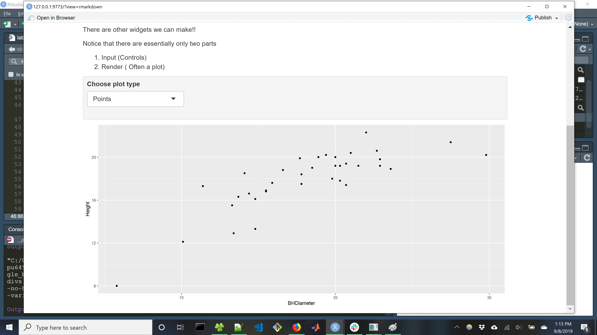
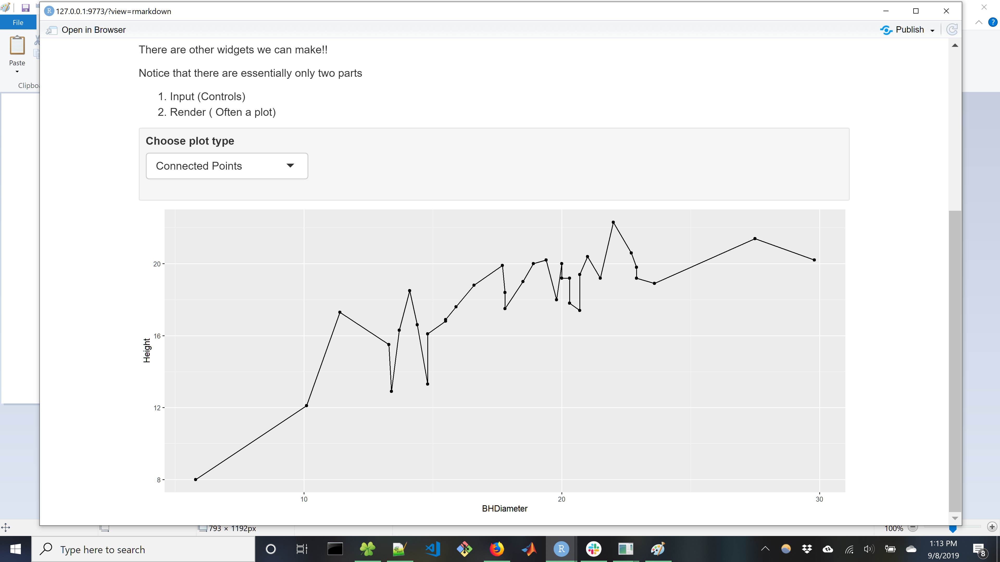

```{r setup, include=FALSE}
knitr::opts_chunk$set(echo = TRUE)
```

# Task 1

First, the working directory is confirmed

```{r}
getwd()
```

# Task 2
Load the data and show the first 6 lines
```{r}
spruce = read.csv("SPRUCE.csv")
head(spruce)
```

# Task 3
With the spruce tree data loaded, a scatter plot of the relationship between height and diameter can be produced:
```{r}
# Plot the spruce tree data appropriately
plot(Height~BHDiameter, main = "Justin Kleiber's Spruce Scatter Plot", bg="Blue", pch=21, cex = 1.2, ylim=c(0,1.1*max(Height)), xlim=c(0,1.1*max(BHDiameter)), data=spruce)
```

From this plot, it looks like there is not a perfectly straight line relationship between height and diameter. To see if this is true, we can generate scatterplots showing the smoothest relationship between the two variables
```{r}
# Load the s20x library and make three trendline scatter plots
library(s20x)
layout(matrix(1:3, nrow = 3, ncol = 1))
trendscatter(Height~BHDiameter, f = 0.5, data = spruce)
trendscatter(Height~BHDiameter, f = 0.6, data = spruce)
trendscatter(Height~BHDiameter, f = 0.7, data = spruce)
```

If we assume a straight line relationship, a trendline can be overlaid on the original scatterplot to show such a relationship. First, a linear model is made and then the relationship is plotted
```{r}
# Make a linear model of the spruce data
spruce.lm = lm(Height~BHDiameter, data = spruce)

# Re-create the scatterplot and overlay the trendline on top of it
plot(Height~BHDiameter, main = "Spruce Scatter Plot with Trendline", bg="Blue", pch=21, cex = 1.2, ylim=c(0,1.1*max(Height)), xlim=c(0,1.1*max(BHDiameter)), data=spruce)
abline(spruce.lm)
```

Based on the smoother curve and this trend line, a straight line does not fit the data well. The smoother curve has some linear regions, but not one unified linear region. The trend line does not fit the scatter data very well either.

# Task 4

```{r}
# Show four plots at once
layout(matrix(1:4,nr=2,nc=2,byrow=TRUE))

# Plot 1, the scatter plot with the fitted line
plot(Height~BHDiameter, main = "Plot with Fitted Line", bg="Blue", pch=21, cex = 1.2, ylim=c(0,1.1*max(Height)), xlim=c(0,1.1*max(BHDiameter)), data=spruce)
abline(spruce.lm)

# Plot 2, same as 1, but with RSS deviations
plot(Height~BHDiameter, main = "RSS Plot", bg="Blue", pch=21, cex = 1.2, ylim=c(0,1.1*max(Height)), xlim=c(0,1.1*max(BHDiameter)), data=spruce)
abline(spruce.lm)

# Predict the values of height from diameter
yhat = fitted(spruce.lm)
# Find residual segments
with(spruce, segments(BHDiameter,Height,BHDiameter,yhat))
RSS = with(spruce, sum((Height - yhat)^2))


# Plot 3, the model sum of squares
plot(Height~BHDiameter, main = "MSS Plot", bg="Blue", pch=21, cex = 1.2, ylim=c(0,1.1*max(Height)), xlim=c(0,1.1*max(BHDiameter)), data=spruce)
abline(spruce.lm)

# Make a naive model (the mean of heights)
with(spruce, abline(h=mean(Height)))

# Predict the values of height from diameter
yhat = fitted(spruce.lm)

# Make the explained deviations (explained by the model)
with(spruce, segments(BHDiameter,mean(Height),BHDiameter,yhat,col="Red"))
MSS=with(spruce,sum((yhat-mean(Height))^2))

# Plot 4, the total sum of squares
plot(Height~BHDiameter, main = "Justin Kleiber's Plot", bg="Blue", pch=21, cex = 1.2, ylim=c(0,1.1*max(Height)), xlim=c(0,1.1*max(BHDiameter)), data=spruce)

# Show the naive model (the mean of heights)
with(spruce, abline(h=mean(Height)))

with(spruce, segments(BHDiameter,Height,BHDiameter,mean(Height),col="Green"))
TSS=with(spruce, sum((Height-mean(Height))^2))
```

From all of these plots, RSS, MSS, and TSS can be calculated:
```{r}
RSS
MSS
TSS
```

We can also see the value of MSS / TSS:
```{r}
MSS/TSS
```
MSS / TSS is called the R-squared value, which shows how well the two variables are correllated. In this case, it is 0.65; if the relationship was stronger it would be closer to 1. In this case, a straight line relationship doesn't exist, resulting in a lower value here.  

Finally, we can verify that TSS = MSS + RSS
```{r}
TSS
MSS + RSS
```

# Task 5
Let's summarize the linear model of the spruce tree data.
```{r}
# Summarizing the spruce linear model
summary(spruce.lm)
```

From this, we can see the slope is 0.48147, with an intercept of 9.14684. Therefore, the equation of the fitted line is 
$$
height = 0.48147*diameter + 9.14684
$$

With this equation we can predict the values of height given a diameter. Let's try that out using R's predict function. For diameters of 15, 18, and 20 cm respectively, here are the predictions:
```{r}
# Predict height for diameters of 15, 18, and 20 cm
predict(spruce.lm, data.frame(BHDiameter = c(15, 18, 20)))
```

# Task 6
Here is a plot of height vs diameter, with shaded lines
```{r}
library(ggplot2)
g = ggplot(spruce, aes(x=BHDiameter,y=Height,colour=BHDiameter))
g = g + geom_point() + geom_line() + geom_smooth(method="lm")
g + ggtitle("Height vs BHDiameter")
```

# Task 7
The shiny app output is below:

<center>
{ width=70% }

{ width=70% }

{ width=70% }

</center>


